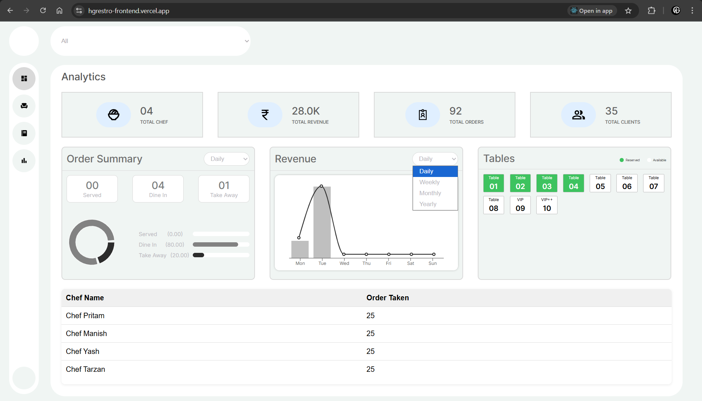

# HG Restro APP:
  It is a comprehensive and modern restaurant management system that streamlines operations such as table management, order tracking, kitchen coordination, and analytics. The application is designed to improve operational efficiency, provide real-time insights, and enhance the customer experience through a responsive and intuitive interface.
   
   
  ADMIN URL: https://hgrestro-frontend.vercel.app
   
  Mobile/Customer URL: https://hgrestro-frontend.vercel.app/menu

## Project Purpose
	HG Restro was built to solve a real-world problem: restaurant owners and managers often struggle to juggle multiple disconnected tools for managing tables, orders, kitchen coordination, and analytics. My goal was to consolidate these operations into one seamless platform, offering real-time insights, automation, and usability across both desktop and mobile devices.
 
## Setup instructions:
  - `npm install`: To install all required dependencies.
  - `npm start`: Runs the app in development mode.
Open [http://localhost:3000](http://localhost:3000) to view it in your browser.

## Core Features and Functionality:
1. Dashboard Analytics
	- View of total chefs, clients, revenue, and orders.
	- Visual charts for revenue and order summary.

2. Table Management
	- Real-time table status: Reserved or Available.
	- Add a table with custom names and chair counts.
	- Search and filter by table number or status.

3. Order Management
	- Track Orders in real time by type (e.g., Dine-in or Takeaway) and by status (Processing, Served, or Not Picked).

4. Menu Management
	- Category-based menu (Drink, Pizza, Burger, etc.).
	- Add/remove items to/from the cart.
	- Mobile-friendly swipe-to-order feature.

5. Checkout & Delivery
	- Collects customer info and cooking instructions.
	- Show estimated delivery time.
	- Summarize the cart with taxes and charges.

6. Chef Order Assignment
   - Automatic order assignment to the chefs based on their availability.
   - List chefs and dynamically show the number of orders handled by each.
    
8. Search & Filters
   - Global search across tables, menu, and orders.
   - Filter panel for analytics, table availability, and order types.
     
10. POS Touch UI
    - On-screen keyboard for inputs.
    - Persistent cart view with smooth checkout flow.

### Challenges Faced:
- Updating the order status based on time.
- Managing complex state across various components like tables, orders, and the Menu.
- Creating an intuitive UI that could support swipe-to-order and on-screen keyboard inputs.

### Tech Stack:
    React.js with reusable components for building dynamic interfaces.
    Vanilla CSS with flexbox and grid for a responsive and user-friendly UI across devices. 
    Redux for state management across the application.
    Node.js + Express for building secure RESTful APIs with routing.
    MongoDB for database operations with Mongoose ORM.
    Recharts for data visualization.
    LocalStorage for cart persistence and quick client-side caching.

### UI Screenshots
